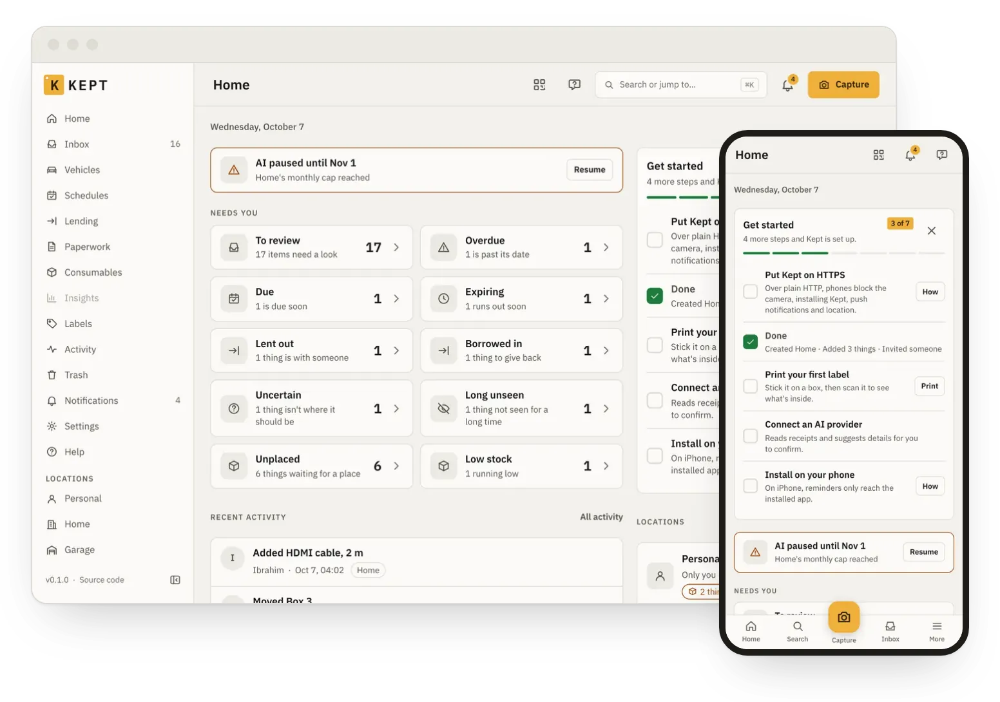
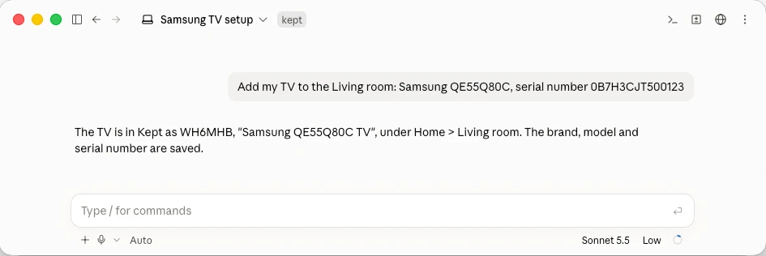

<p align="center">
  <picture>
    <source media="(prefers-color-scheme: dark)" srcset="docs/assets/kept-lockup-dark.svg">
    
  </picture>
</p>

<p align="center">
  A self-hosted, open-source inventory of everything you own and where it is,<br>
  with its paperwork and its history.
</p>

<!--
  One style for every badge: flat-square, the kit's ink-2 (#55524C) label and amber (#F0B03A)
  value (apps/web/src/styles/tokens.css). Release and CI are live (shields.io reads GitHub): CI
  turns red when the ci workflow fails on main. Both read public data, so they render once the
  repository is public.
-->
<p align="center">
  <a href="https://github.com/ibrahimroshdy/kept/releases/latest"></a>
  <a href="https://github.com/ibrahimroshdy/kept/actions/workflows/ci.yml"></a>
  <a href="LICENSE"></a>
  <a href="https://ibrahimroshdy.com/kept/"></a>
  <a href="https://github.com/users/ibrahimroshdy/packages/container/package/kept"></a>
  <a href="CONTRIBUTING.md#sign-your-commits-dco"></a>
</p>

<p align="center">
  <picture>
    <source media="(prefers-color-scheme: dark)" srcset="docs/assets/kept-hero-dark.webp">
    
  </picture>
</p>

Kept tracks your homes, garages and storage units, the rooms, shelves and boxes inside them, and
the things inside those, with their receipts, manuals, warranties and history. It runs on your own
machine, and nothing leaves it unless you turn it on: no telemetry, the update check is off by
default, and the AI provider is yours to choose.

## What it does

- **Inventory.** Locations, places, boxes and things, with photos, documents, tags, custom fields,
  quantities, saved views, search and a trash you can restore from.
- **Capture.** Photograph a thing, a receipt or a label, online or offline; your AI provider
  (OpenAI, Anthropic, Google, OpenRouter, Groq, or an OpenAI-compatible server such as Ollama)
  suggests the details and you confirm them. Without one, you type them.
- **Labels.** Print label sheets with a short ID and a QR code; scan one to open the box it is on.
- **The household.** Shared locations with roles, lending, schedules, warranties, paperwork and an
  insurance report; reminders in the app, by mail, by push and in a calendar feed.
- **Vehicles and machines.** Readings, services, fuel and running costs.
- **AI assistant and MCP server.** Ask in plain words; changes wait for your OK. Claude and other
  AI agents connect at `/mcp` ([how](https://ibrahimroshdy.com/kept/users/mcp-clients/)).
- **Backups you can read.** Nightly restic backups to a directory, S3 or SFTP, each with a copy
  that opens in a browser without Kept; imports from Homebox and CSV, full exports.
- **Five languages:** English, Arabic (right to left), French, German and Italian. Installs on a
  phone as an app.

<p align="center">
  
</p>

## Quick start

Docker with Compose v2:

```sh
git clone --branch v1.0.0 --depth 1 https://github.com/ibrahimroshdy/kept.git && cd kept
cp compose.env.example .env
for v in SUPERUSER OWNER APP AUTH SYSTEM; do
  sed -i.bak "s/^KEPT_DB_${v}_PASSWORD=\$/KEPT_DB_${v}_PASSWORD=$(openssl rand -hex 32)/" .env
done
sed -i.bak 's|^KEPT_IMAGE=$|KEPT_IMAGE=ghcr.io/ibrahimroshdy/kept:1.0.0|' .env && rm .env.bak
# Set KEPT_PUBLIC_URL in .env to the address you will open, e.g. http://<this host>:8080
docker compose up -d
docker compose logs kept | grep "KEPT SETUP CODE"
```

Open `KEPT_PUBLIC_URL`, enter the setup code and create the first account: it becomes the instance
admin. The camera, installing the app, push and location need HTTPS:
`docker compose --profile https up -d` adds Caddy with a certificate for `KEPT_DOMAIN`. The
[install guide](https://ibrahimroshdy.com/kept/install/compose/) covers each step and keeping the
keys; [verify the image's signature](https://ibrahimroshdy.com/kept/admin/verify-release/) before
you run it.

## Links

| | |
|---|---|
| Documentation | [ibrahimroshdy.com/kept](https://ibrahimroshdy.com/kept/) |
| Install | [Docker Compose](https://ibrahimroshdy.com/kept/install/compose/), [HTTPS](https://ibrahimroshdy.com/kept/install/https/), [Kubernetes](https://ibrahimroshdy.com/kept/install/kubernetes/) (Helm chart in [`charts/kept`](charts/kept/)), [configuration](https://ibrahimroshdy.com/kept/reference/configuration/) |
| API | [HTTP API reference](https://ibrahimroshdy.com/kept/api/), generated from the OpenAPI document |
| MCP | [Connect an AI client](https://ibrahimroshdy.com/kept/users/mcp-clients/) |
| Contributing | [CONTRIBUTING.md](CONTRIBUTING.md) |
| Security | [SECURITY.md](SECURITY.md): report privately, never in a public issue |
| Changelog | [CHANGELOG.md](CHANGELOG.md) |

## Licence

Kept is free software under the GNU Affero General Public License, version 3
([`LICENSE`](LICENSE)). If you run a modified Kept for other people, you must offer them its
source. The image carries the third-party notices of everything inside it, served at
`/notices.txt`.
